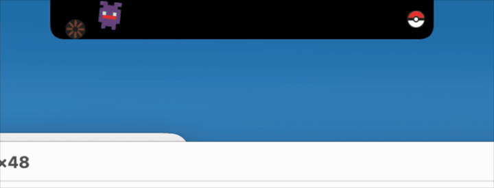
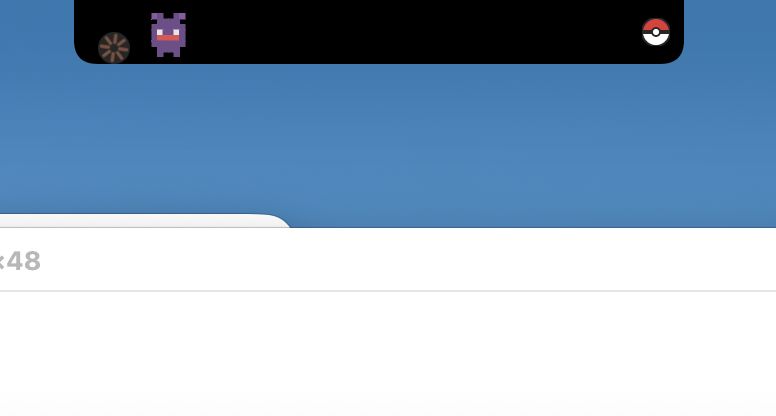
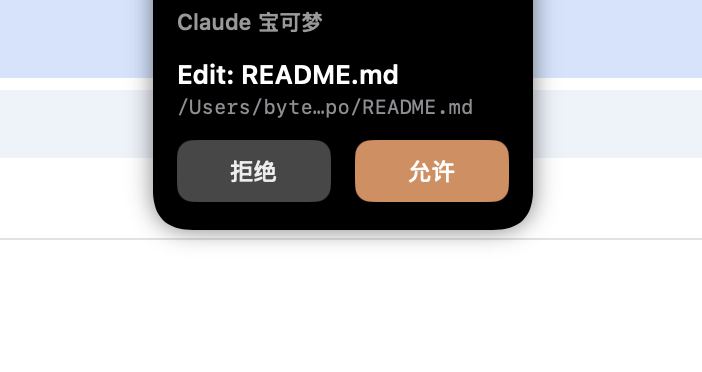

# Claude Pokemon

一个 macOS 灵动岛（刘海）应用，在 Claude Code 工作时显示一只宝可梦伙伴。纯 SwiftUI + AppKit 构建，零依赖。

## 演示



## 截图

| 收起状态（活跃中） | 展开状态（权限请求） |
|:---:|:---:|
|  |  |

## 功能特性

- **灵动岛集成** — 宝可梦住在你 MacBook 的刘海区域
- **物理动画** — Claude 转圈球在场景中弹跳，宝可梦会踢球、头顶、跳跃与之互动
- **待机动画** — Claude Code 空闲时，宝可梦每 3 秒跳动一次
- **权限拦截** — Claude Code 的权限请求以刘海弹窗形式展示，支持允许/拒绝操作
- **扭蛋捕捉系统** — 通过工具调用积攒捕捉机会，收集全部 151 只初代宝可梦
- **图鉴** — 菜单栏展示已捕获的宝可梦，可随时切换当前伙伴
- **点击互动** — 点击宝可梦区域触发兴奋反应 + 精灵球晃动
- **中英双语** — 支持中文和英文界面

## 宝可梦稀有度分布（共 151 只）

| 稀有度 | 掉率 | 数量 |
|--------|------|------|
| 普通 | 40% | ~36 |
| 稀有 | 30% | ~63 |
| 珍稀 | 18% | ~37 |
| 史诗 | 9% | ~12 |
| 传说 | 3% | 2（超梦、梦幻） |

## 积分与捕捉系统

- 每次工具调用获得积分：Edit/Write/Bash = 3 分，Read/Grep/Glob = 1 分
- 积满 100 分自动兑换 1 次捕捉机会
- 首次启动赠送 10 次捕捉机会
- 抽到重复宝可梦额外返还 20 分

## 编译与安装

```bash
make          # 编译
make install  # 安装到 /Applications
make run      # 编译并启动
make clean    # 清理构建产物
make uninstall # 从 /Applications 卸载
```

需要 macOS 14+ 且配备刘海屏的 MacBook（MacBook Pro 14"/16"、MacBook Air M2+）。

## 架构

```
Claude Code hooks/客户端  -->  Unix Socket  -->  ClaudePokemon.app
                           /tmp/claude-island.sock
```

### 项目结构

```
claude-pokemon/
  App/            — 应用入口、AppDelegate、状态栏菜单
  Window/         — NotchWindow (NSPanel)、NotchContentView、屏幕几何
  Views/          — ExpandedNotchView（权限弹窗）、PokemonSpriteView（像素画）
  Pokemon/        — PokemonCharacter（151 种宝可梦、像素画、扭蛋）
  IPC/            — SocketServer、SessionManager、SessionState
```

## 系统要求

- macOS 14+
- 带刘海屏的 MacBook
- Claude Code hooks 或客户端集成，向 `/tmp/claude-island.sock` 发送会话 JSON
